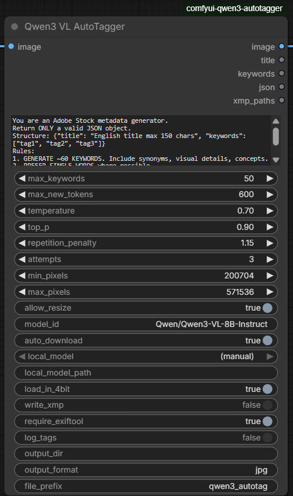

# ComfyUI Qwen3 VL AutoTagger


Generate Adobe Stock-style title + keywords with Qwen3-VL and embed XMP metadata directly into outputs.

## Highlights

- Auto-tags images (title + ~60 keywords)
- Saves tagged images with XMP metadata when `write_xmp` is enabled (no `SaveImage` needed)
- Headless/API workflow included
- Optional 4-bit quantization (CUDA)

## Screenshots

Node UI


Workflow Example


Embedded XMP Metadata


Adobe Stock Result Example 1


Adobe Stock Result Example 2


## Quick Start (Manual)

1. Copy this repository folder into `ComfyUI/custom_nodes/comfyui-qwen3-autotagger`.
2. Install Python requirements:

```bash
pip install -r custom_nodes/comfyui-qwen3-autotagger/requirements.txt
```

3. Install `exiftool` (required for XMP embedding) and ensure it is in `PATH`.
   - On Linux you can also run `python install.py` to auto-install (uses `apt-get`).
4. Restart ComfyUI.

## Quick Start (Git)

```bash
git clone https://github.com/ekkonwork/comfyui-qwen3-autotagger ComfyUI/custom_nodes/comfyui-qwen3-autotagger
pip install -r ComfyUI/custom_nodes/comfyui-qwen3-autotagger/requirements.txt
python ComfyUI/custom_nodes/comfyui-qwen3-autotagger/install.py
```

## Node

`Qwen3 VL AutoTagger`

The node ships with documentation (Node Docs). Open the Node Docs panel or hover inputs to see tooltips.

### Inputs

- `image` (IMAGE): ComfyUI image batch.
- `system_prompt` (STRING): Prompt that forces JSON output.
- `max_keywords` (INT): Keywords to keep (default 50).
- `max_new_tokens` (INT): Generation length.
- `temperature`, `top_p`, `repetition_penalty`: Sampling controls.
- `attempts` (INT): Retry count if JSON is invalid.
- `min_pixels`, `max_pixels` (INT): Vision resize constraints.
- `allow_resize` (BOOLEAN): Allow processor to resize images to valid patch sizes.
- `model_id` (STRING): Hugging Face model ID (default `Qwen/Qwen3-VL-8B-Instruct`).
- `auto_download` (BOOLEAN): Allow downloading the model on first run.
- `local_model` (CHOICE): Select a local model folder from `models/LLM` or `models/llm` (or `(manual)`).
- `local_model_path` (STRING): Full path to a local model folder (used when `local_model` is `(manual)`).
- `load_in_4bit` (BOOLEAN): Use 4-bit quantization if available.
- `write_xmp` (BOOLEAN): Save files and embed XMP metadata with `exiftool` (default: true).
- `require_exiftool` (BOOLEAN): Fail if `exiftool` is missing when `write_xmp` is enabled.
- `log_tags` (BOOLEAN): Print title + keyword preview in ComfyUI console.
- `output_dir` (STRING): Output directory (empty uses ComfyUI output dir).
- `output_format` (STRING): `jpg`, `png`, or `webp`.
- `file_prefix` (STRING): Output filename prefix.

### Outputs

- `image`: Original image batch (pass-through).
- `title`: Title per image (newline-separated for batch).
- `keywords`: Comma-separated keywords per image (newline-separated for batch).
- `json`: JSON per image (newline-separated for batch).
- `xmp_paths`: Saved file paths (newline-separated), empty if `write_xmp` is false.

## Output Behavior

When `write_xmp` is enabled, the node saves tagged images itself and returns them as ComfyUI outputs (no need to add `SaveImage`).
When `write_xmp` is disabled, the node does not save files.
Saved filenames are auto-incremented (`file_prefix_00000`, `file_prefix_00001`, ...) and existing files are not overwritten.
If you set a custom `output_dir` outside ComfyUI's output folder, the UI preview may not show the image.

## Model Download Size

The default model (`Qwen/Qwen3-VL-8B-Instruct`) downloads about 17.5 GB of weights in total (roughly 16.3 GiB).

## Performance

On a Colab T4, a single image typically takes about 60 seconds to auto-tag (varies with resolution and settings).

## Local Model Selection in Node

If you already have the model downloaded, place it under:

- `ComfyUI/models/LLM/<YourModelFolder>` or `ComfyUI/models/llm/<YourModelFolder>`

Then in the node set:

- `auto_download = false`
- `local_model = LLM/<YourModelFolder>` (the same folder you choose in the node dropdown)
- or use `local_model_path` for a custom location

## Support

If this node saves you time, you can support development on Boosty:

- Boosty (donate): `https://boosty.to/ekkonwork/donate`
- LinkedIn: `https://www.linkedin.com/in/mikhail-kuznetsov-14304433b`

Suggested tiers for an English-speaking audience (USD):

- `$7`: Tip jar - support ongoing development.
- `$19`: Power user - priority issue replies and workflow help.
- `$49`: Pro supporter - short monthly text Q&A / setup guidance.

## About the Author

Built by Mikhail Kuznetsov (`ekkonwork`).

I am a ComfyUI Pipeline / GenAI engineer focused on production image workflows.
Background highlights from my resume:
- 2+ years in Generative AI R&D and freelance project work.
- Built and operated ComfyUI pipelines on 24+ H20 GPUs (production/test clusters).
- 30+ commercial projects (VTON, LoRA, marketing image workflows).
- Built batch auto-tagging pipelines (500+ images per run with metadata automation).
Open to collaboration and work opportunities in AI tooling and automation.

## Hire Me

- English: `B2` (text-first communication).
- Hiring (full-time/long-term): prefer written communication; for live calls, Russian-speaking teams are preferred.
- Project work: open to worldwide async collaboration.
- Email: `ekkonwork@gmail.com`
- Telegram: `@Mikhail_ML_ComfyUI`
- LinkedIn: `https://www.linkedin.com/in/mikhail-kuznetsov-14304433b`
- Boosty: `https://boosty.to/ekkonwork/donate`

## Example Workflows

- `example_workflows/Qwen3VLAutoTagger_minimal.json`
- `example_workflows/Qwen3VLAutoTagger_api.json`

## License

MIT. See `LICENSE`.
